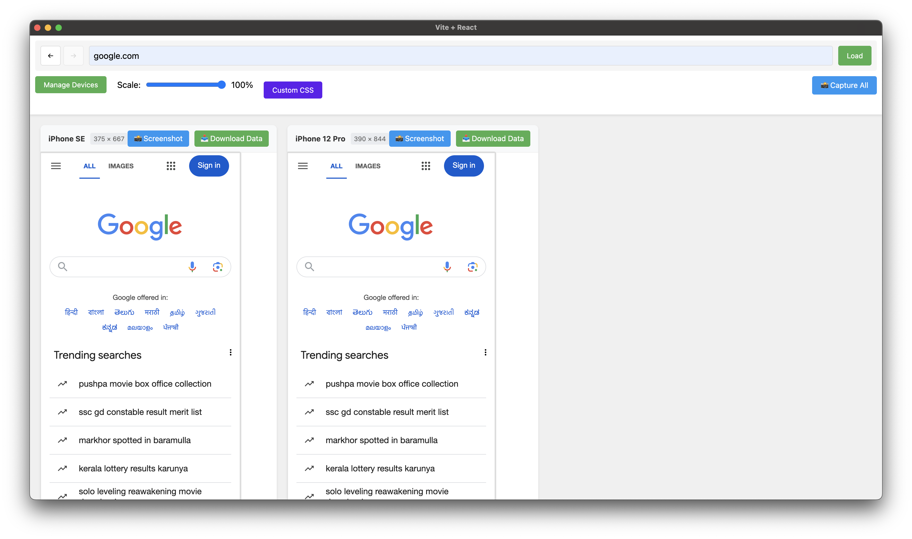

# BrowserStacks



A professional Electron-based application for testing websites across multiple device viewports simultaneously. Built with React and Electron, it provides real-time previews, synchronized scrolling, and comprehensive device emulation.

## Features

### 🖥️ Device Management
- Pre-configured device presets (iPhone, iPad, Android devices, etc.)
- Custom device configurations
- Enable/disable devices
- Drag-and-drop reordering
- Device grouping (Mobile, Tablet, Desktop)

### 🔄 Synchronized Features
- Synchronized scrolling across devices
- URL history with back/forward navigation
- Custom CSS injection for all viewports
- Network throttling simulation

### 📸 Screenshot Capabilities
- Individual device screenshots
- Capture all devices at once
- Screenshots bundled in organized ZIP files
- Automatic timestamping and naming

### 📊 Device Data Collection
- Console logs capture
- Network request monitoring
- Browser metadata collection
- Performance metrics
- Comprehensive data export

## Installation
```bash
git clone https://github.com/narveer-rathore/browser-stacks.git
cd responsive-device-viewer
npm install
npm start
```

## Project Structure

Each directory serves a specific purpose:
- `components/`: Modular UI components
- `utils/`: Shared helper functions
- `hooks/`: Reusable React hooks
- `context/`: Global state management
- `styles/`: CSS and styling files
- `electron/`: Desktop app configuration


## Usage Examples

### 1. Device Management
- Click the "Manage Devices" button to open device settings
- Toggle devices on/off using the switches
- Drag and drop to reorder devices
- Add custom devices with specific dimensions and user agents

### 2. Custom CSS Injection
- Use the "Custom CSS" button to open the CSS editor
- Enter your CSS rules
- Click "Apply CSS" to see changes across all devices
- CSS persists across sessions

### 3. Screenshot Capture
- Click the screenshot button on individual devices
- Use "Capture All" to screenshot all enabled devices
- Screenshots are automatically named and timestamped
- Find your screenshots in a convenient ZIP file

### 4. Data Collection
- Click "Download Data" on any device to collect:
  - Current screenshot
  - Console logs
  - Network requests
  - Browser metadata
- Data is organized in a ZIP file with README

## Key Components

### DeviceView
The main viewport component that:
- Renders accurate device dimensions
- Handles user agent spoofing
- Manages screenshot capture
- Collects device data

### NavigationControls
URL management component with:
- URL input and validation
- History navigation
- Loading state indication
- URL suggestions

### DeviceManager
Configuration interface for:
- Device settings
- Layout organization
- Viewport management
- Group controls

## Contributing

1. Fork the repository
2. Create your feature branch (`git checkout -b feature/AmazingFeature`)
3. Commit your changes (`git commit -m 'Add some AmazingFeature'`)
4. Push to the branch (`git push origin feature/AmazingFeature`)
5. Open a Pull Request

## License

This project is licensed under the MIT License - see the [LICENSE.md](LICENSE.md) file for details.

## Roadmap

- [ ] Device rotation support
- [ ] Network condition simulation
- [ ] Touch event simulation
- [ ] Device frame overlays
- [ ] Cloud storage integration
- [ ] Collaborative features

## Support

For support, please open an issue in the repository.

---

Built with ❤️ using React and Electron
